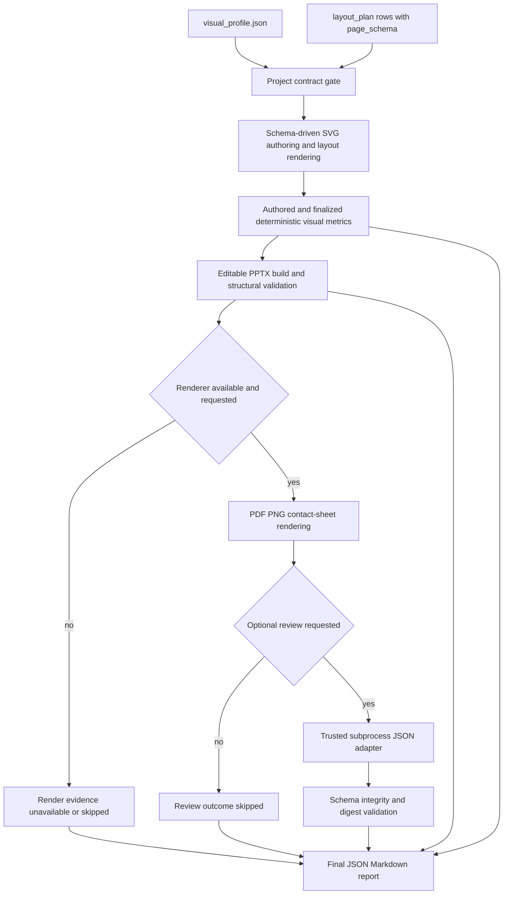
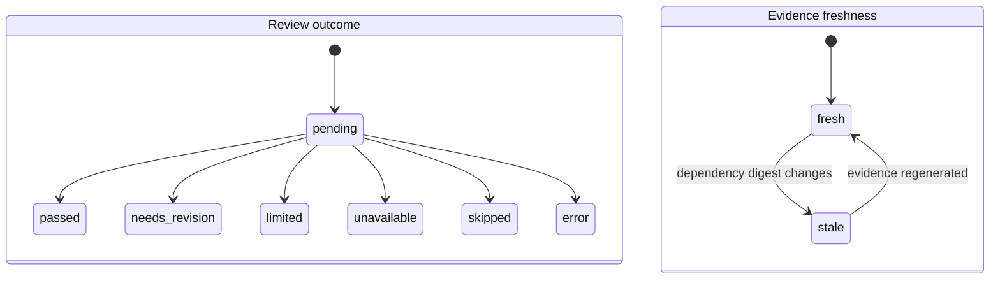

# Visual Quality and Review System - Plan

## Goal Capsule

- **Objective:** Raise the repeatable visual-quality floor of GHB PPT output by constraining page composition, measuring real geometry, and closing the rendered-evidence review loop.
- **Authority:** This plan follows `docs/SKILL工作流与模型能力依赖分析报告-20260713.md`, then the confirmed hybrid scope, then existing repository contracts and offline-first safety rules.
- **Execution profile:** Implement in dependency order with characterization coverage before changing current report, exit-code, checkpoint, or renderer behavior.
- **Stop conditions:** Stop and ask if implementation would make a remote/model service mandatory, weaken current deterministic gates, auto-rewrite authored SVG from model feedback, or require a broad vendored `ppt_master` refactor.
- **Tail ownership:** Completion includes focused tests, the full offline suite, deterministic benchmark evidence, rendered review where the environment supports it, documentation, and an independent final diff review.

---

## Product Contract

### Summary

The optimization adds a versioned visual direction contract, schema-driven page composition, deterministic visual-quality evidence, and an optional advisory visual-model review adapter. Offline deterministic checks remain authoritative. The model layer is opt-in, evidence-only, and unable to override deterministic failures or mutate the deck.

### Problem Frame

The current pipeline reliably produces editable, structurally valid, template-faithful PPTX files, but the remaining quality ceiling sits in model-dependent decisions: page hierarchy, content scale, whitespace, focal emphasis, semantic composition, and cross-slide rhythm. Existing validators detect many technical failures but cannot distinguish a technically valid composition from one that is visually weak, repetitive, or underscaled. The workflow therefore needs stronger authoring constraints and review evidence without pretending that subjective aesthetics can be reduced to one synthetic score.

### Requirements

**Authoring contracts**

- R1. Every new or updated real project must carry a versioned `visual_profile.json` that defines typography, spacing, occupancy, emphasis, focal, and deck-rhythm policies while preserving GHB brand constants.
- R2. Every `layout_plan.json` row must carry a versioned nested `page_schema` that names the page purpose, layout variant, density, focal item or zone, emphasis intent, and text or node budgets using the existing `slide_id` as canonical identity. Concrete component bounds are renderer-derived evidence; an authored bound is an optional validated override, not a required model-authored coordinate.
- R3. Built-in layout rendering must consume the page schema and visual profile so content length, density, and emphasis change actual geometry and hierarchy rather than only labels or colors.

**Deterministic visual evidence**

- R4. Authored and finalized SVG checks must derive per-page visual metrics from visible geometry and declared QA boxes, not trust `layout_plan.json` or `data-layout` as proof of rendered composition.
- R5. Deterministic reports must cover measurable content occupancy, focal dominance, title/body scale, alignment and spacing deviation, primary-color budget, metric coverage, and supported-geometry limitations.
- R6. Deck-level checks must detect repeated composition fingerprints, focal-zone streaks, density/rhythm drift, and archetype/variant repetition across body slides.
- R7. Reports must emit stable issue codes, measured evidence, expected profile ranges, affected `slide_id`, severity, and suggested action without generating a composite aesthetic score.
- R8. Deterministic visual-quality hard failures are limited to malformed contracts, invalid geometry, stale evidence, and explicitly declared measurable bounds with sufficient metric coverage; uncalibrated balance and rhythm heuristics remain warnings. Required-review failures and adapter-security failures are governed separately by R11, R17, AE7, and AE8.

**Optional visual-model review**

- R9. A single opt-in subprocess/JSON adapter may review allowlisted page PNG or contact-sheet evidence plus bounded page metadata and deterministic findings.
- R10. Model findings must be schema-validated, advisory, per-slide, evidence-located, and unable to override deterministic errors or automatically change SVG/PPTX content.
- R11. Missing renderers, missing target fonts, adapter timeouts, malformed responses, and non-zero exits must produce explicit `skipped`, `limited`, `unavailable`, or `error` states; default offline builds remain usable without the adapter.
- R12. The adapter receives an explicit minimal environment allowlist; secrets must not appear in argv, project files, adapter payload metadata, raw persisted streams, logs, checkpoints, or quality reports. Every adapter declares `local` or `remote` capability. Remote-capable review requires a separate explicit authorization naming provider, destination, retention policy, and exact slide membership; credential variable names come only from trusted operator-local configuration, credential values are never accepted through CLI/project files, and core records only names and presence—not values.

**Evidence lifecycle and regression**

- R13. Visual reports and checkpoints must bind through one versioned evidence manifest to canonical digests of their relevant profile, layout, SVG, PPTX, render, renderer/DPI/font environment, rule contract, adapter identity, and review policy so stale evidence cannot be reused after inputs change.
- R14. Final JSON and Markdown reports must show deterministic status, optional-review status, provenance, limitations, and per-slide findings consistently.
- R15. The repository must include offline-rebuildable approved and failing visual fixtures with stable expected issue codes, narrow numeric tolerances, and human preference evidence; PNG pixel equality must not be a required CI gate.
- R16. The default CLI and CI path must remain network-free and must never invoke the visual-model adapter unless explicitly requested.
- R17. Adapter configuration must come from explicit CLI input or trusted operator-local configuration; project content must never select an executable, and evidence paths, process resources, response structure, and before/after artifact integrity must be bounded and verified.

### Acceptance Examples

- AE1. Given a project with an unknown visual-profile schema or a page missing `page_schema`, when `check-project` runs, then it fails before cover or content outputs are written and reports a stable contract issue code.
- AE2. Given an SVG whose `data-layout` says `timeline` but whose geometry is a repeated underscaled card row, when authored visual checks run, then the report flags real occupancy or composition-fingerprint issues instead of accepting the marker as evidence.
- AE3. Given a valid offline build with no review adapter configured, when `build` runs, then deterministic evidence is produced, review status is `skipped`, and no external process or network dependency is invoked.
- AE4. Given a model response that says a page passes while deterministic geometry has a blocking error, when reports are composed, then the deterministic failure remains authoritative and the model result is retained only as advisory evidence.
- AE5. Given a completed visual review, when the profile, page schema, SVG, PPTX, rendered PNG, DPI, or font environment changes, then dependent evidence is marked stale and cannot satisfy review completion.
- AE6. Given LibreOffice rendering without Microsoft YaHei, when visual review runs, then geometry may be reviewed but CJK typography fidelity is marked `limited` or `unreviewable`, never passed.
- AE7. Given a malformed, oversized, timed-out, or non-zero adapter response, when optional review runs, then the failure is visible, bounded, preserved in run evidence, and does not silently become a passing review.
- AE8. Given a trusted adapter that modifies protected project artifacts, returns traversal/symlink references, exceeds resource bounds, leaves observable descendants, or injects active report content, when review runs, then enforceable violations are rejected or detected, review completion fails, and bounded security evidence is retained without persisting the malicious stream. Untrusted adapters require an explicitly configured OS-sandboxed launcher; the direct-subprocess contract does not claim same-user filesystem or network isolation.
- AE9. Given a remote-capable adapter without a separate disclosure authorization, or with credential values supplied by CLI/project content, when review is requested, then execution fails before evidence leaves the machine and no credential value is persisted.
- AE10. Given an agent starting or migrating a repository-owned project, when it follows the documented scaffold and examples, then it produces valid profile/page schemas without manual JSON repair, placeholder filler, or invented low-level coordinates.

### Success Criteria

- All existing structural, editable-output, template, and offline regression gates continue to pass.
- Approved benchmark pages produce no blocking visual-contract errors; every intentionally failing benchmark produces its expected stable issue codes.
- A frozen stratified corpus contains at least 30 curated pages across six versioned page purposes, with at least two calibration, one pilot-holdout, and two final-holdout pages per purpose. Thresholds are tuned only on calibration cases; the pilot gate uses only pilot-holdout cases, while the final success claim uses untouched final-holdout judgments. Optimized output must be preferred in at least 70% of eligible final-holdout judgments, with no purpose-level preference regression and no structural-regression veto.
- Re-running deterministic checks on unchanged inputs produces identical categorical results and stable metrics within documented tolerances.
- Default builds demonstrably perform no model invocation and remain valid on machines without a renderer.
- Every final report makes rendered fidelity, font limitations, optional-review status, and evidence freshness independently inspectable.
- A pilot over two representative archetype families must meet the documented pilot-holdout preference and deterministic false-positive gates before all-archetype expansion or optional-review integration begins.

### Scope Boundaries

**In scope**

- Versioned visual-profile and nested page-schema contracts.
- Content-aware geometry and emphasis variants for the existing Office-safe layout library.
- Deterministic page and deck visual metrics over actual SVG/PPTX evidence.
- One provider-neutral subprocess/JSON visual-review contract.
- CLI, checkpoint, render, final report, benchmark, test, and skill-documentation integration.

**Deferred to Follow-Up Work**

- Multi-candidate page generation and pairwise automatic ranking.
- Learned user preference profiles or model fine-tuning.
- Additional visual-review providers or a provider marketplace.
- Automatic aesthetic repair loops or model-authored SVG mutations.
- Expanding the bundled archetype catalog beyond needs proven by benchmark gaps.

**Out of scope**

- Replacing the template, OOXML merge pipeline, DrawingML converter, or full-slide editability model.
- Making web search, AI image generation, paid services, or network access part of the default build.
- Treating a model score as final subjective approval.
- Claiming target Office/CJK visual fidelity without the required renderer and font environment.

### Sources

- `docs/SKILL工作流与模型能力依赖分析报告-20260713.md` defines the remaining model-dependent quality gaps and P1/P2 priorities.
- `scripts/validate_project_contract.py` provides the existing hand-validated versioned contract and cross-file drift pattern.
- `scripts/ghb_svg_quality.py` aggregates authored/finalized SVG checks into machine-readable evidence.
- `scripts/ghb_ppt.py` is the only orchestration, run-log, output, and checkpoint boundary.
- `scripts/validate_ghb_pptx.py` composes final structural, SVG, render, JSON, and Markdown evidence.
- `tests/fixtures/build_baseline.py` and `tests/fixtures/scenarios.json` define the current offline, non-overwriting regression pattern.
- `references/vendor-sync-policy.md` requires GHB-specific orchestration to remain at the top level and vendored changes to stay narrow.

---

## Planning Contract

### Key Technical Decisions

- KTD1. **Keep semantic page composition inside `layout_plan.json`.** Add a versioned nested `page_schema` per existing row instead of creating a second page roster. Author purpose, density, focal/emphasis intent, budgets, and an optional bound override; derive concrete component bounds in the renderer and record them as immutable evidence.
- KTD2. **Use `visual_profile.json` for project-wide direction.** The profile separates invariant GHB brand tokens from selectable composition, typography, spacing, occupancy, focal, and rhythm policies.
- KTD3. **Make deterministic evidence authoritative.** Optional model review may add findings but cannot change deterministic severity, exit status, or artifact contents.
- KTD4. **Separate measurement from policy.** Generic geometry extraction produces immutable stage-scoped measurements and coverage; top-level GHB policy evaluates profile thresholds into findings; report composition consumes both without rewriting raw observations.
- KTD5. **Adopt calibrated hard and advisory bands.** Contract errors and explicit well-covered hard bounds block; hierarchy, balance, color, and cross-slide similarity begin advisory until benchmark calibration demonstrates acceptable false-positive behavior.
- KTD6. **Use one trusted direct subprocess adapter.** Adapter selection comes only from explicit CLI or trusted operator-local configuration. Resolve a canonical regular executable, run without a shell from a dedicated temporary evidence workspace, pass a minimal environment allowlist, bound the full process tree and all input/output structures, and ship no provider SDK in core. Core does not apply adapter-authored mutations; it detects project-artifact changes before accepting review evidence.
- KTD7. **Give provenance one owner.** A top-level versioned evidence manifest defines canonicalization, the dependency DAG, tool/rule/policy versions, immutable evidence envelopes, and freshness evaluation. Timestamps, run paths, and other volatile fields stay outside canonical digests.
- KTD8. **Keep report composition side-effect free.** `report` validates and composes existing fresh evidence; only explicit render and explicit review actions create those externalized artifacts.
- KTD9. **Keep model feedback non-operative.** Suggested fixes return to the authoring workflow and require the normal SVG gate, build, validate, render, and review cycle; the security model treats the adapter as trusted local executable code rather than claiming portable filesystem isolation.
- KTD10. **Enforce a one-way vendor boundary.** Top-level code validates GHB contracts and converts them into provider-neutral layout intent. Vendored modules accept generic geometry inputs and return generic observations; they never import GHB schemas, thresholds, issue codes, report states, or adapter policy.
- KTD11. **Model outcome, freshness, and reviewability independently.** Review outcome uses `passed`, `needs-revision`, `limited`, `unavailable`, `skipped`, or `error`; freshness uses `fresh` or `stale`; limitations list dimensions that cannot be judged. Completion rules evaluate these fields rather than overloading one state machine.
- KTD12. **Freeze and partition the comparison corpus before changing geometry.** Current representative inputs, outputs, purpose labels, and blind-review rubric are captured before renderer changes and assigned immutably to calibration, pilot-holdout, or final-holdout partitions. Tune only on calibration cases, use pilot-holdout only for U11, and make the final success claim only from still-sealed final-holdout judgments.
- KTD13. **Migrate repository-owned projects atomically and make legacy use explicit.** All examples, fixtures, and callers move to v1 contracts in the same delivery. A temporary explicit legacy flag may preserve external project access with a prominent limitation, but default checks do not silently infer missing visual intent; the flag and removal condition must be documented and tested.
- KTD14. **Own the visual vocabulary at the top-level contract.** `references/project-contract.md` owns the v1 profile values, six-purpose taxonomy, defaults, inheritance/override precedence, invalid combinations, and fallback behavior; `page_schema.page_purpose` uses that versioned taxonomy and ambiguous mixed-purpose pages choose one primary purpose plus optional secondary tags.
- KTD15. **Gate expansion on an early value pilot.** After contracts and the frozen corpus exist, implement only timeline and matrix pilot families plus provisional metrics. Expansion to all archetypes and optional-review integration requires the blinded pilot-holdout preference threshold, no represented-purpose regression, zero structural vetoes, and the frozen deterministic false-positive ceiling.

### V1 Visual Contract Vocabulary

| Concern | V1 values and ownership | Default and precedence |
|---|---|---|
| Page purpose | `architecture`, `process`, `comparison`, `timeline`, `metrics`, `summary`; owned by `references/project-contract.md` | One required primary purpose; optional secondary tags never change benchmark grouping. Unknown values fail; mixed pages choose the dominant reader task. |
| Density | `breathing`, `balanced`, `dense` | Profile default → page override. An override cannot violate font floors or component budgets. |
| Rhythm role | `anchor`, `continuity`, `transition` | Profile deck-rhythm policy → page override. `anchor` is a rhythm role, not a new layout archetype. |
| Emphasis | `single-focal`, `ranked`, `distributed` | Page intent overrides the profile default; focal target is required for `single-focal`. |
| Layout variant | Existing archetype plus a catalogued semantic variant | `comparison` is a semantic alias of the existing `matrix`; metric callout is a variant of an existing metric-capable structure, not a silent new archetype. New archetypes require a separate catalog decision. |
| Bounds | Renderer-derived component boxes; optional authored override | Derived by default. Overrides must be within slide/body bounds, preserve budgets, and are reported separately from observed final geometry. |

Representative valid examples for anchor, dense, and breathing pages—and invalid precedence/budget combinations—belong in `references/project-contract.md` and executable fixtures, not only prose.

### High-Level Technical Design

The evidence flow keeps deterministic and model-dependent judgments separate until final report composition.

Review outcome and evidence freshness are orthogonal rather than inferred from file existence.

### Sequencing

1. Freeze the current comparison corpus and blind-review rubric before changing renderer geometry.
2. Land versioned authoring contracts and one evidence-manifest/freshness owner.
3. Implement the two-family pilot and provisional metrics, then evaluate only the untouched pilot-holdout partition; keep final-holdout labels sealed.
4. Expand existing layouts and deterministic policy only if the pilot value gate passes.
5. Integrate deterministic freshness, rendering, checkpoints, final reports, and failure evidence.
6. Add the optional review adapter and its separate integration only after deterministic envelopes, provenance, and the pilot gate are stable.
7. Complete benchmark calibration, documentation, and end-to-end verification.

### System-Wide Impact

- **Agent parity:** Agents gain the same durable evidence humans obtain from contact sheets; no review conclusion exists only in chat state.
- **Project artifacts:** New profile data and nested page schemas become part of the authoring contract for real projects and trusted fixtures.
- **CLI lifecycle:** Build, report, resume, and review behavior gain freshness checks and explicit skipped/limited/error states.
- **Compatibility:** Existing report `passed == no errors` semantics remain; new advisory warnings must not silently change current exit codes.
- **Security:** External review receives an allowlist of rendered evidence and bounded metadata, never arbitrary workspace files or serialized environment state.

### Risks and Mitigations

| Risk | Mitigation |
|---|---|
| Geometry metrics report false precision for transformed/path/text content | Emit coverage and confidence; enforce only on supported, sufficiently covered geometry. |
| Thresholds overfit current fixtures | Freeze calibration, pilot-holdout, and final-holdout partitions; tune only on calibration, gate expansion on pilot-holdout, and calculate the final success threshold only from still-sealed final-holdout judgments. |
| Renderer or font substitution corrupts visual judgment | Carry renderer, DPI, font availability, substitutions, and warnings into review provenance and per-dimension reviewability. |
| New contracts break legacy examples | Migrate repository examples and fixtures atomically; allow legacy behavior only in an explicit, warning-producing compatibility path if required. |
| Model adapter leaks data or secrets | Use a narrow direct-executable contract, strict payload allowlist, size/time bounds, and redacted run logging. |
| A configured adapter inherits repository-user privileges | Treat direct adapters as trusted same-user code; require an explicitly configured OS-sandboxed launcher for untrusted code, use snapshot-only inputs/minimal environment, and verify protected artifact digests before and after execution. |
| Remote review discloses slide content or credentials | Require separate remote authorization with provider/destination/retention/slide-membership provenance; accept only credential variable names from trusted local config and never persist values. |
| Evidence paths escape or change after validation | Canonicalize fresh run-owned regular files, reject symlinks/traversal, bind exact bytes and slide membership, and enforce image/payload limits before launch. |
| Faulty adapters exhaust resources or leave child processes | Stream under byte limits, enforce one wall-clock deadline and JSON complexity bounds, terminate the process group, and avoid automatic retry for contract/security failures. |
| Model text injects active report content | Treat slide and response content as untrusted, validate enums/locations, bound strings, discard unknown fields, and escape accepted text for Markdown/terminal rendering. |
| Model advice masks deterministic failure | Compose sources independently and preserve deterministic severity and exit status. |
| Vendored changes become difficult to synchronize | Keep changes narrow, documented, reusable, and covered by focused tests under the vendor policy. |
| Checkpoint paths exist but evidence is stale | Store and verify dependency digests before accepting a checkpoint or review artifact. |

---

## Implementation Units

### U9. Freeze the pre-change visual comparison corpus

- **Goal:** Preserve representative current inputs, outputs, page-purpose labels, and a blind-review rubric before any renderer geometry changes.
- **Requirements:** R15, R16; AE2, AE6.
- **Dependencies:** None.
- **Files:** `tests/fixtures/visual_quality_cases.json`, `tests/fixtures/visual_preferences.json`, `tests/fixtures/build_visual_benchmark.py`, `tests/test_visual_benchmark.py`, `docs/visual-quality-benchmark.md`.
- **Approach:** Select at least 30 current pages across the six v1 purposes from existing technical, management, and layout-stress scenarios, with at least two calibration, one pilot-holdout, and two final-holdout pages per purpose and stratification by content length and item count. Assign cases immutably before renderer work. Record scenario inputs, current categorical evidence, rebuild instructions, renderer/font limitations, and the blind-review protocol. Keep generated binary evidence non-overwriting and rebuildable.
- **Execution note:** Characterize and freeze the comparison corpus before changing `svg_layouts.py`; do not backfill “before” artifacts from a post-change renderer.
- **Patterns to follow:** Existing A/B/C/D offline baselines, non-overwriting builders, preserved failed runs, and contact-sheet evidence.
- **Test scenarios:**
  1. The corpus covers anchor, dense, and breathing rhythms, all six page purposes, and documented content-length/item-count bands.
  2. The builder refuses to overwrite canonical pre-change evidence.
  3. Every case records source scenario identity, renderer/DPI/font provenance, and a stable page-purpose label.
  4. Calibration/pilot-holdout/final-holdout assignment is immutable; tuning cannot read either holdout label set, and U11 cannot read final-holdout labels.
  5. Blind-review records randomize pair order, hide before/after identity, collect at least three independent eligible judgments per page, preserve ties/abstentions, and reject incomplete or duplicate judgments.
  6. Preference denominator excludes ties/abstentions, requires at least two eligible non-tie judgments per evaluated holdout page, aggregates first per page then across pages, and applies any structural regression as a page-level veto.
  7. Corpus generation requires no network, model adapter, or secret.
  8. The deterministic pilot gate permits zero blocking false positives on approved cases and at most 10% advisory false-positive rule/case pairs; the exact labeled denominator is frozen before U11.
- **Verification:** The repository can reproduce and identify the exact pre-change pages and rubric later used for the 70% preference claim.

### U1. Version visual-profile and page-schema contracts

- **Goal:** Establish one project-wide visual profile and one nested per-slide page schema as required, validated authoring inputs.
- **Requirements:** R1, R2, R7, R13; AE1, AE5.
- **Dependencies:** None.
- **Files:** `scripts/validate_project_contract.py`, `scripts/ghb_ppt.py`, `references/project-contract.md`, `tests/test_visual_profile.py`, `tests/test_ghb_ppt_cli.py`, `examples/claude_code_arch_demo/visual_profile.json`, `examples/claude_code_arch_demo/layout_plan.json`, `examples/layout_demos/visual_profile.json`, `examples/layout_demos/layout_plan.json`, `examples/layout_demos/generate_demo_svgs.py`, `tests/fixtures/build_baseline.py`.
- **Approach:** Define `ghb.visual-profile.v1` and `ghb.page-schema.v1` with additive-field tolerance and unknown-major rejection. Extend the current hand-validation and cross-file drift style instead of adding a JSON Schema dependency. `init` writes a valid GHB default profile; layout planning remains responsible for page schemas before SVG authoring.
- **Execution note:** Add characterization tests for current `check-project`, fixture allowance, and fail-before-output behavior before making the new files mandatory.
- **Rollout note:** U1 may implement and exercise the contracts on pilot fixtures, but must not switch default enforcement or migrate all repository-owned projects until U11 passes. After the gate, enable the contract and migrate the complete repository-owned set atomically under KTD13.
- **Patterns to follow:** `ghb.confirmation.v1`, `ghb.content-model.v1`, stable issue codes, `confirmation_digest`, and trusted-fixture restrictions in `scripts/validate_project_contract.py`.
- **Test scenarios:**
  1. A valid default profile and complete nested page schemas pass and retain unknown additive fields.
  2. Missing profile, unknown major version, malformed density bands, missing focal data, or page-schema/layout mismatch fails with stable path-aware codes.
  3. Confirmation outline, `slide_id`, density, layout archetype, and page-schema variant drift is rejected before outputs are created.
  4. `init --dry-run` writes nothing; normal `init` creates a valid default profile without fabricating user confirmation or page decisions.
  5. Trusted fixtures follow the explicit fixture policy while a real project cannot bypass required contracts.
  6. The documented scaffold and both repository examples can be generated or migrated by a fresh agent without manual JSON repair, generic filler values, or authored component coordinates.
- **Verification:** A new project has a valid profile scaffold, and every real authored project must pass the versioned profile/page contract before SVG gates run.

### U11. Prove the core visual-quality bet with a two-family pilot

- **Goal:** Test the highest-risk value hypothesis before expanding geometry work or integrating optional model review.
- **Requirements:** R2 through R8, R15, R16; AE2, AE10.
- **Dependencies:** U9, U1, U8.
- **Files:** `scripts/ppt_master/svg_layouts.py`, `scripts/ghb_visual_quality.py`, `tests/test_svg_layouts.py`, `tests/test_visual_metrics.py`, `tests/fixtures/visual_quality_cases.json`, `tests/fixtures/visual_preferences.json`, `docs/visual-quality-benchmark.md`.
- **Approach:** Implement schema-driven geometry only for the existing `timeline` and `matrix` families, plus the smallest provisional occupancy/focal/spacing metrics needed to evaluate them. Tune on calibration cases only, then run the frozen blind protocol against untouched pilot-holdout cases while final-holdout labels remain sealed. Record the gate decision and evidence before U2, U3, U4, or U10 proceeds.
- **Gate:** Proceed only when eligible pilot-holdout judgments prefer the pilot in at least 70% of comparisons, every page purpose represented by the two families is non-regressing, structural veto count is zero, approved cases have zero blocking false positives, and advisory false-positive rule/case pairs are at most 10% under the denominator frozen in U9. Otherwise stop, retain evidence, and revise or abandon the contract/renderer approach.
- **Test scenarios:**
  1. Pilot code cannot read pilot-holdout labels during tuning and cannot read final-holdout labels at all.
  2. Timeline and matrix variants alter normalized geometry and preserve visible content/editability-safe primitives.
  3. Gate calculation follows the frozen reviewer, tie, denominator, aggregation, and veto rules exactly.
  4. A failed gate blocks full-archetype and optional-adapter units without weakening the threshold.
- **Verification:** A signed-off pilot record demonstrates value on unseen pages before the plan incurs all-archetype and optional-review cost.

### U8. Establish the evidence manifest and freshness evaluator

- **Goal:** Give canonical digests, dependency invalidation, evidence envelopes, and freshness decisions one reusable architectural owner.
- **Requirements:** R7, R11, R13, R14, R17; AE5, AE7, AE8.
- **Dependencies:** U1.
- **Files:** `scripts/evidence_manifest.py`, `references/evidence-contract.md`, `tests/test_evidence_manifest.py`.
- **Approach:** Define a versioned manifest with canonical input identities, dependency edges, tool/rule/policy versions, and immutable stage envelopes. Canonical digests exclude timestamps, absolute/output paths, and other volatile values. Freshness evaluation verifies the complete dependency DAG and exposes a small top-level API consumed by metrics, rendering, review, checkpoints, and final reports.
- **Patterns to follow:** Canonical `confirmation_digest`, versioned JSON contracts, explicit state files, atomic report writes, and fail-visible stale evidence.
- **Test scenarios:**
  1. Canonically equivalent JSON with different key order yields the same digest, while semantic threshold or schema changes invalidate dependent evidence.
  2. Timestamps, run directories, and output paths do not change canonical digests.
  3. Profile/layout/SVG, PPTX, render-environment, deterministic-report, adapter/policy, and final-report dependencies invalidate exactly the downstream envelopes declared by KTD7.
  4. Copying an envelope to another project/run or omitting a required dependency cannot satisfy freshness.
  5. Unknown manifest versions, cycles, duplicate identities, or mismatched byte digests fail with stable codes.
- **Verification:** All later stages share one manifest implementation, and no stage infers freshness from path existence or timestamps.

### U2. Make built-in layouts schema-driven and content-aware

- **Goal:** Make density, variant, focal intent, emphasis, item count, and text budgets alter actual Office-safe geometry and hierarchy.
- **Requirements:** R3, R8, R15; AE2.
- **Dependencies:** U11.
- **Files:** `scripts/ppt_master/svg_layouts.py`, `tests/test_svg_layouts.py`, `tests/test_baseline_fixture.py`, `references/svg-layout-catalog.md`, `references/vendor-sync-policy.md`.
- **Approach:** Extend `LayoutSpec` through backward-compatible inputs or migrate all in-repo callers atomically. All ten existing archetypes consume density and emphasis constraints; `comparison` maps to the existing `matrix`, `anchor` remains a rhythm role, and metric callout is implemented only as a catalogued variant of an existing metric-capable structure. The high-use structures receive distinct compact, balanced, or editorial geometry where semantics support it. Reject over-budget component input rather than globally shrinking type.
- **Execution note:** Prove current renderer structure first, then change one archetype family at a time and inspect generated SVG sequentially after regeneration.
- **Patterns to follow:** Plain Office-safe `rect`, `polygon`, `line`, `text`, and `g`; explicit `data-layout`; actual-geometry diversity tests; the prior iceberg lesson that geometry must change rather than only color or labels.
- **Test scenarios:**
  1. The same content under `breathing`, `anchor`, and `dense` produces bounded, materially different scale and spacing while respecting font floors.
  2. Two declared variants produce different normalized geometry, not only different markers or colors.
  3. The focal item or zone receives measurable prominence and remains visible after SVG-to-PPTX conversion inputs are finalized.
  4. Minimum and maximum supported item counts render without clipping; over-budget text or nodes fail with an actionable contract issue.
  5. Existing examples remain deterministic and every planned item appears as visible text.
  6. Unsupported constructs such as filters, masks, `foreignObject`, CSS-dependent layout, or marker arrows are not introduced.
- **Verification:** Renderer fixtures demonstrate real composition variation, stable editability-safe primitives, and bounded text behavior across all supported archetypes.

### U3. Add deterministic page and deck visual metrics

- **Goal:** Produce explainable visual-quality findings from actual SVG geometry with explicit measurement coverage.
- **Requirements:** R4, R5, R6, R7, R8, R15; AE2.
- **Dependencies:** U1, U8, U2.
- **Files:** `scripts/ghb_visual_quality.py`, `scripts/ghb_svg_quality.py`, `scripts/ppt_master/visual_asset_checker.py`, `scripts/ppt_master/check_layout_diversity.py`, `tests/test_visual_metrics.py`, `tests/test_ghb_svg_quality.py`, `tests/test_visual_asset_checker.py`, `references/visual-quality-rules.md`.
- **Approach:** Add a top-level GHB policy engine over generic, immutable geometry measurements and evidence envelopes. Compute per-page occupancy, focal ratio, title/body scale, alignment, spacing, emphasis-color area, and coverage. Compute body-slide composition fingerprints and rhythm streaks from normalized geometry plus semantic roles. Keep authored, finalized, and final-PPTX observations separate; policy exceptions may suppress findings but never rewrite raw measurements.
- **Execution note:** Start with failing fixtures for fake diversity, empty visible content, underscaled composition, repeated focal zones, and unsupported geometry coverage.
- **Patterns to follow:** Existing `Result(errors, warnings)`, `data-qa-role`, `data-qa-box`, density limits, stage-specific reports, and `passed == no errors` semantics.
- **Test scenarios:**
  1. A page with normal markers but repeated card geometry receives the expected composition warning.
  2. Empty or invisible planned content remains a hard error through the existing content gate.
  3. Supported shapes and QA boxes yield deterministic metrics and issue codes within narrow numeric tolerances.
  4. Transformed groups, unsupported paths, or unknown text extents lower coverage and produce `partial` or `not-measurable`, not false failures.
  5. Background, master decoration, header, footer, and deliberate bleed are excluded from body occupancy.
  6. Adjacent pages with repeated fingerprints or focal zones trigger deck warnings while intentional, declared repetition can be reviewed without changing the raw measurement.
  7. Warnings remain advisory; malformed contracts and existing geometry errors continue to fail.
- **Verification:** `reports/svg-authored.json` and `reports/svg-finalized.json` contain stable per-slide metrics, deck findings, coverage, and actionable evidence without a composite score.

### U4. Define the optional visual-review adapter and evidence lifecycle

- **Goal:** Accept bounded, schema-valid, advisory visual-model findings without introducing a provider or network dependency into core.
- **Requirements:** R9, R10, R11, R12, R13, R16, R17; AE3, AE4, AE5, AE6, AE7, AE8.
- **Dependencies:** U1, U8, U3.
- **Files:** `scripts/review_visual_quality.py`, `references/visual-review-contract.md`, `tests/test_visual_review_adapter.py`.
- **Approach:** Define versioned request/response schemas over fresh evidence envelopes. Accept adapter selection, local/remote capability, credential variable names, and any OS-sandboxed launcher only from trusted operator-local configuration or explicit non-secret CLI input. Resolve a canonical regular executable, snapshot approved regular non-symlink evidence into a dedicated temporary directory, construct a minimal child environment, stream under byte limits, enforce one overall deadline and process-group cleanup, and retain only the validated response projection. A remote-capable adapter additionally requires a separate disclosure authorization naming provider, destination, retention, and exact slide membership. Requests contain stable page identity/role, bounded image bytes and dimensions, deterministic findings, renderer/font limitations, and opaque digests. Responses carry per-dimension reviewability, severity, normalized slide coordinates, evidence, action, and untrusted reviewer metadata. The direct adapter is trusted same-user code; untrusted code is rejected unless the configured launcher supplies the required OS isolation.
- **Patterns to follow:** `subprocess.run` argument arrays, visible `PipelineError` handling, bounded retry policy, atomic JSON evidence, and the repository rule that subjective findings are recorded instead of converted into fake scores.
- **Test scenarios:**
  1. No adapter configuration performs no subprocess invocation and returns `skipped`.
  2. A valid adapter sees only allowlisted fields and produces a schema-valid per-slide advisory report.
  3. Project-supplied commands, mutable project-local shims, traversal paths, symlinks, non-regular files, evidence from another run, and unapproved contact-sheet membership are rejected.
  4. The child sees only the explicit environment allowlist; secrets in argv/project JSON are rejected, and echoed secrets or raw malicious streams never reach persisted reports or logs.
  5. Endless output, slow stdin, descendant processes, deep JSON, excessive findings, long strings, unsupported images, and aggregate payload overflow terminate under one bounded operation without retry storms.
  6. A model pass cannot override deterministic failure; artifact modification during review is detected by before/after digests and prevents completion.
  7. Missing target fonts marks typography/CJK dimensions limited while allowing supported geometry dimensions to be reviewed.
  8. Changing image order/bytes, deterministic findings, adapter executable/registration, schema, policy, model identifier, or tool contract rejects the review as stale.
  9. HTML, Markdown links, terminal controls, fabricated paths, unknown fields, and tool/action requests are rejected or escaped before report composition.
  10. Remote mode without separate disclosure authorization fails before launch; authorization provenance is digest-bound and records provider/destination/retention/slide membership without content or credential values.
  11. Credential values in CLI/project content are rejected; core resolves allowlisted variable names from the trusted local environment and records only variable name and presence.
- **Verification:** The adapter remains optional, provider-neutral, resource-bounded, non-operative in core, and fully testable with local fake executables; the plan does not claim portable sandboxing that the subprocess mechanism cannot provide.

### U5. Integrate deterministic freshness, rendering, CLI stages, and final reports

- **Goal:** Make the unified CLI, run records, checkpoints, render reports, and final reports authoritative for the new visual evidence.
- **Requirements:** R7, R11, R13, R14, R16; AE3, AE5, AE6.
- **Dependencies:** U8, U3.
- **Files:** `scripts/ghb_ppt.py`, `scripts/render_ghb_pptx.py`, `scripts/validate_ghb_pptx.py`, `tests/test_ghb_ppt_cli.py`, `tests/test_render_ghb_pptx.py`, `tests/test_validate_ghb_pptx.py`.
- **Approach:** Keep `check-svg` as the deterministic authored/finalized primitive, extend checkpoint inputs/outputs with dependency digests, and make render produce an atomic report for success and failure. Keep `report` side-effect free and preserve current exit-code semantics. Define JSON/Markdown hierarchy as: deterministic outcome, freshness, reviewability/limitations, blocking findings, advisory findings, then per-slide evidence/actions; render `skipped`, `limited`, `unavailable`, `stale`, and `error` explicitly.
- **Execution note:** Characterize current dry-run order, report schemas, render failure behavior, and checkpoint state before extending them.
- **Patterns to follow:** `RunContext`, stage records, atomic output replacement, pre-render/final report separation, bounded deterministic repair, and final JSON/Markdown parity.
- **Test scenarios:**
  1. Default `build` has no optional-review dependency and records review `skipped` while producing deterministic visual evidence.
  2. `--no-render` and missing-renderer paths remain supported and report review `unavailable` rather than visual pass.
  3. Render success and failure both leave atomic `render-report.json` evidence with renderer, DPI, font, outputs, warnings, and status.
  4. Profile/layout/SVG/PPTX/render/environment changes invalidate only the dependent checkpoints and reports defined by the evidence manifest.
  5. JSON and Markdown reports agree on deterministic status, freshness, limitations, provenance, and per-slide issue counts and preserve the mandated hierarchy.
  6. `report` rejects or labels stale evidence and never invokes rendering or review as a hidden side effect.
- **Verification:** A build or resumed run cannot claim fresh visual evidence unless every dependency digest and environment constraint matches the recorded report.

### U10. Integrate the optional review action without blocking deterministic delivery

- **Goal:** Attach the U4 adapter to fresh render evidence and final reports as a separable opt-in extension.
- **Requirements:** R9 through R14, R16, R17; AE3 through AE9.
- **Dependencies:** U4, U5.
- **Files:** `scripts/ghb_ppt.py`, `scripts/validate_ghb_pptx.py`, `tests/test_ghb_ppt_cli.py`, `tests/test_validate_ghb_pptx.py`.
- **Approach:** Add an explicit review action/build option that runs only after fresh rendering and before side-effect-free report composition. Requiring review converts unavailable/error/security states into an explicit review-stage failure without masking deterministic evidence. Model findings remain visually and semantically subordinate to blocking deterministic findings.
- **Test scenarios:**
  1. Deterministic build/report tests pass when U10 is absent or no adapter is configured.
  2. Explicit review runs after fresh rendering; stale/missing render evidence prevents launch.
  3. Required-review unavailable/error/security states fail only the review requirement and preserve deterministic status/evidence.
  4. JSON/Markdown reports expose outcome, freshness, reviewability, provenance, limitations, and per-slide advisory findings consistently.
- **Verification:** Optional integration can be delivered, disabled, or removed without changing the deterministic build/report contract.

### U6. Build and calibrate the offline visual benchmark

- **Goal:** Turn visual-quality expectations into reproducible approved/failing fixtures and human preference evidence.
- **Requirements:** R15, R16; AE2, AE3, AE6.
- **Dependencies:** U9, U2, U3, U5.
- **Files:** `tests/fixtures/visual_quality_cases.json`, `tests/fixtures/visual_preferences.json`, `tests/fixtures/build_visual_benchmark.py`, `tests/fixtures/scenarios.json`, `tests/fixtures/build_baseline.py`, `tests/test_visual_benchmark.py`, `tests/test_baseline_fixture.py`, `docs/visual-quality-benchmark.md`.
- **Approach:** Reuse the frozen U9 corpus, tune profiles/variants/tolerance bands only on calibration cases, use pilot-holdout only for U11, and keep final-holdout labels sealed until U6 evaluation. Blind review randomizes pair order and requires at least three independent eligible judgments per page; ties/abstentions are retained but excluded from the preference denominator, page preference is determined before deck-level aggregation, and any structural regression vetoes that page. Keep PPTX/PDF/PNG outputs rebuildable and non-overwriting rather than using pixel-perfect images as CI truth.
- **Patterns to follow:** Existing A/B/C/D offline scenario matrix, refusal to overwrite canonical baselines, preserved failed runs, and contact-sheet evidence.
- **Test scenarios:**
  1. Approved fixtures produce no blocking visual errors and only allowlisted calibrated warnings.
  2. Fake diversity, empty text, long-title overflow, underscaled content, overused primary color, repeated focal zones, and font-limited rendering produce expected stable codes.
  3. Rebuilding the same case produces identical categorical results and metrics within explicit tolerances.
  4. The builder refuses to overwrite canonical outputs and preserves intermediate and failed evidence.
  5. Benchmark execution requires no network, model key, or adapter; optional model evidence is excluded from deterministic CI assertions.
  6. Holdout-only blind preference records demonstrate at least 70% eligible preference, no purpose-level regression, no structural veto, and full auditability of reviewer eligibility, randomization, ties, abstentions, denominator, and disagreements.
- **Verification:** The benchmark can detect aesthetic-proxy regressions, renderer limitations, and geometry improvements without relying on brittle PNG equality.

### U7. Update the agent authoring and recovery workflow

- **Goal:** Make the new visual contracts, review states, repair boundaries, and evidence obligations discoverable and enforceable for skill users.
- **Requirements:** R1 through R17.
- **Dependencies:** U9, U1 through U6, U8, U10, U11.
- **Files:** `SKILL.md`, `README.md`, `references/authoring-workflow.md`, `references/svg-layout-catalog.md`, `references/visual-quality-rules.md`, `references/quality-and-recovery.md`, `references/project-contract.md`, `references/visual-review-contract.md`, `tests/test_skill_docs.py`.
- **Approach:** Update the required project artifacts, planning sequence, CLI flow, evidence list, review-state meanings, report hierarchy, font/render limitations, and repair loop. For schema/budget failures, recover in this order: preserve semantics and shorten only redundant wording; choose another catalogued variant/density; split the page at a semantic boundary; request user judgment. Never silently delete required content, globally shrink below floors, or invent bounds/filler. Keep visual-model review explicitly optional and human final approval explicit. Document what metrics can and cannot prove.
- **Patterns to follow:** Concise top-level `SKILL.md`, detailed task-specific references, fail-visible guidance, and the existing separation between deterministic repairs and authored-content rework.
- **Test scenarios:**
  1. Documentation names every required artifact, schema, CLI path, report, and review state consistently.
  2. The default documented workflow remains offline and never implies that a visual-model adapter or paid service is required.
  3. Documentation never equates deterministic success, model advice, or a missing-font render with final aesthetic approval.
  4. Recovery guidance requires regeneration after digest invalidation and preserves failed evidence.
  5. A fresh-agent exercise creates and migrates representative contracts using only the scaffold/references and reaches `check-project` without manual JSON repair or placeholder content.
  6. Recovery examples distinguish safe automatic wording/variant changes from page splitting or semantic changes that require user confirmation.
- **Verification:** A fresh agent can follow `SKILL.md` and linked references from project initialization through deterministic checking, optional review, repair, and final evidence-backed delivery without inventing missing policy.

---

## Verification Contract

| Gate | Command or evidence | Proves |
|---|---|---|
| Focused contracts | `python3 -m pytest -q tests/test_visual_profile.py tests/test_ghb_ppt_cli.py` | Visual-profile/page-schema validation, initialization, fail-fast behavior, and offline defaults. |
| Layout rendering | `python3 -m pytest -q tests/test_svg_layouts.py tests/test_baseline_fixture.py` | Content-aware variants, Office-safe geometry, visible text, and deterministic render behavior. |
| Deterministic metrics | `python3 -m pytest -q tests/test_visual_metrics.py tests/test_ghb_svg_quality.py tests/test_visual_asset_checker.py` | Actual-geometry metrics, coverage handling, issue stability, and deck rhythm. |
| Evidence lifecycle | `python3 -m pytest -q tests/test_evidence_manifest.py` | Canonical digests, dependency invalidation, immutable envelopes, and freshness decisions. |
| Optional adapter | `python3 -m pytest -q tests/test_visual_review_adapter.py` | Payload allowlist, schema validation, failure states, staleness, non-operative core behavior, and artifact-integrity detection. |
| Pipeline integration | `python3 -m pytest -q tests/test_render_ghb_pptx.py tests/test_validate_ghb_pptx.py tests/test_ghb_ppt_cli.py` | Stage order, render evidence, checkpoint freshness, report parity, and exit-code compatibility. |
| Benchmark | `python3 -m pytest -q tests/test_visual_benchmark.py tests/test_baseline_fixture.py` plus regenerated benchmark reports/contact sheets | Stable issue codes, tolerance bands, approved/failing fixture coverage, and visual before/after evidence. |
| Full regression | `python3 -m pytest -q` | No regression across cover, SVG, OOXML, editability, validation, render, baseline, and CLI behavior. |
| Static quality | Repository-supported Python compilation/lint checks used by the current quality workflow | New modules import cleanly and follow repository conventions. |
| Final pipeline | `python3 scripts/ghb_ppt.py check-project`, full build, validate, render when available, and report on representative technical/management/stress projects | End-to-end contract, artifacts, report freshness, optional-review behavior, and visual evidence. |
| Human preference | Holdout-only blind review records in `tests/fixtures/visual_preferences.json` and representative contact sheets | At least 70% eligible preference, no page-purpose regression, no structural veto, and auditable reviewer/randomization/tie/denominator handling. |

Checks that require Microsoft YaHei or a target Office renderer are conditional on environment availability. Their absence must produce an explicit limitation and prevents a typography-fidelity completion claim; it does not invalidate deterministic geometry verification.

---

## Definition of Done

- U1 is complete when new projects receive a valid visual profile, every authored page has a validated nested page schema, and contract drift fails before output.
- U9 is complete when the pre-change comparison corpus and blind-review rubric are frozen before renderer changes and remain reproducible without network/model access.
- U11 is complete when the two-family pilot passes the frozen pilot-holdout preference, represented-purpose, structural-veto, and deterministic false-positive gates without exposing final-holdout labels; failure stops expansion rather than lowering the bar.
- U8 is complete when one versioned evidence manifest owns canonical digests, dependency edges, stage envelopes, and freshness evaluation for every consuming stage.
- U2 is complete when all built-in archetypes consume density and emphasis constraints, high-frequency variants change real geometry, and over-budget content cannot be hidden by global shrinking.
- U3 is complete when authored/finalized reports contain stable, explainable page/deck metrics with coverage and no composite score.
- U4 is complete when the optional adapter is provider-neutral, allowlisted, bounded, schema-validated, digest-bound, non-operative in core, protected by artifact-integrity checks, and demonstrably absent from default execution.
- U5 is complete when deterministic CLI stages, render success/failure evidence, checkpoints, resume behavior, and final JSON/Markdown reports agree on freshness, hierarchy, and limitations without depending on U4/U10.
- U10 is complete when explicit optional review integrates after fresh rendering, required-review failures remain separate, and deterministic delivery still works with the integration absent.
- U6 is complete when the offline benchmark covers at least 30 stratified pages with two calibration, one pilot-holdout, and two final-holdout pages per purpose, detects all declared negative cases, and records the final-holdout-only preference result under the frozen protocol.
- U7 is complete when the skill and references describe one consistent offline-first authoring, validation, optional-review, recovery, and delivery workflow.
- All existing and new focused tests pass, the full offline suite passes, and representative projects complete their applicable build/validate/render/report gates.
- Final diff review confirms every changed line supports this objective, vendored edits are narrow, public behavior is preserved unless explicitly versioned, secrets are absent, and no unrelated refactor or formatting churn was introduced.
- Failed experiments, obsolete fixtures, temporary adapters, dead branches, and abandoned generated artifacts are removed before completion; preserved diagnostic evidence remains only where the contract requires it.
